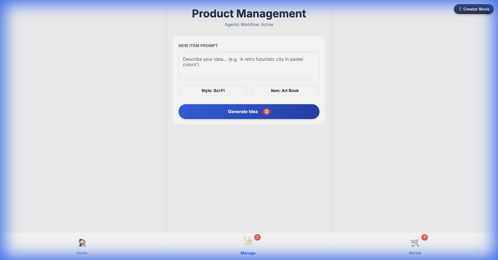
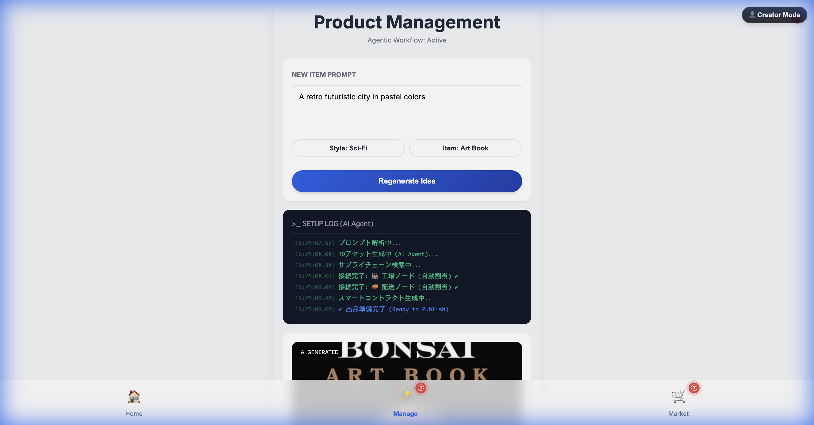
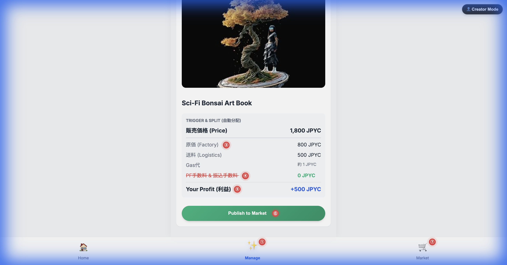
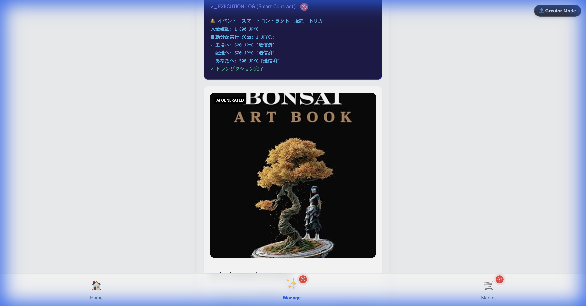
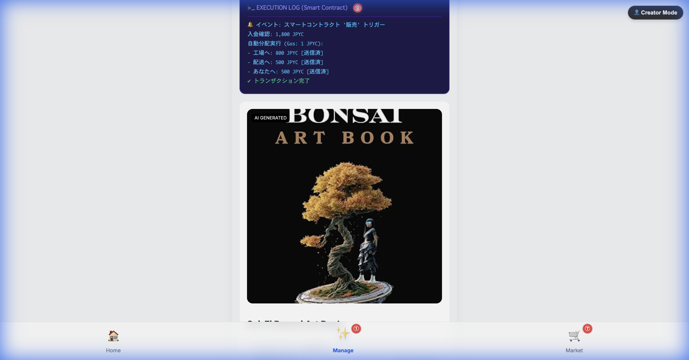

# デモ操作マニュアル：暗号商流（クリプト・フロー）

**[🔴 プレゼン資料を表示する (Speaker Deck)](https://speakerdeck.com/showyingart/pod-with-jpyc)**
**[🔴 デモアプリを開く（Live Mockup）](https://showying.github.io/pj_jpyc-ideathon/frontend/)**

本ドキュメントは、JPYC Ideathon 提出プロジェクト「暗号商流（クリプト・フロー） 〜ボーダレスEC/POD with JPYC〜」のデモアプリ操作ガイドです。全9ステップを通じて、AIエージェントとステーブルコインがどのようにクリエイターの「カネ」と「テマ」の壁を解消するかを解説します。

---

## 🏗️ Phase 1: Creation & Automation (Manageタブ)
**クリエイター視点：AI店長による業務の自動化とコスト構造の透明性**

### 【手順①】Start - 課題の提示

- **操作**: 「Manage」タブを開き、商品案のプロンプトを入力できる状態を確認します。
- **解決するPain**: **テマの壁**。何を売るか、どう作るかを悩む時間コストを削減するための入り口です。

### 【手順②】Generate Idea - AIによる商品提案

- **操作**: 「Generate Item Idea」をクリック。AIが3Dアセットの生成、工場の検索、スマートコントラクトの準備を並列で実行します。
- **解決するPain**: **テマの壁**（サプライチェーン構築）。通常、工場探しや契約には数週間かかりますが、AIエージェントがオンチェーン/オフチェーンを横断して数秒で「商流」を自動構築します。

### 【手順③〜⑤】Cost Breakdown - 利益構造の可視化

- **操作**: 生成されたアイテムのコスト内訳（原価・送料・利益）を確認します。
- **解決するPain**: **カネの壁**（多重手数料）。既存ECでは3.6%+40円、プラットフォーム手数料3%〜などが引かれますが、JPYC直決済によりそれらが「0 JPYC」化され、低単価商品でも利益（+500 JPYC）が出ることを証明します。

### 【手順⑥】Publish - 商品の公開

- **操作**: 「Publish to Market」をクリック。
- **解決するPain**: **テマの壁**（出品作業）。本来なら商品登録や説明文の作成が必要ですが、ワンクリックでマーケットへ反映されます。

---

## 🛒 Phase 2: Purchase & Experience (Marketタブ)
**買い手視点：JPYC決済がトリガーする「魔法」の体験**

### 【手順⑦】Marketplace - UIの確認

- **操作**: 買い手として「Market」タブを確認。
- **特長**: Sci-Fi Bonsaiシリーズの世界観が統一された、プレミアムな購入体験を提供します。

### 【手順⑧】Buy Action - 決済と自動分配の演出

- **操作**: 商品（Art Book）をクリックして購入。コインが複数の宛先へ飛んでいくアニメーションが発生。
- **解決するPain**: **カネの壁**（振込コスト）＆ **テマの壁**（経理作業）。スマートコントラクトにより、購入と同時に工場・配送・クリエイターへ資金が「自動分配」されます。月末の集計も振込作業も、人間は一切行いません。

---

## ✅ Phase 3: Execution & Revenue (Manageタブ)
**実証：非中央集権的な自律実行**

### 【手順⑨】Execution Log - 処理完了の証明

- **操作**: 自動的に「Manage」タブに戻り、スマートコントラクトの実行ログを確認します。
- **特長**: 「入金確認 → 分配実行 → 送金完了」のプロセスが完全に自律化されている様子をログで表示。クリエイターは、寝ている間に商品が売れ、利益がウォレットに届いている状態を体験できます。

---

## 🏁 まとめ
「暗号商流（クリプト・フロー）」は、単なる決済手段の変更ではありません。
JPYCを「AIが扱える日本円」として位置づけ、スマートコントラクトで商流そのものをコード化したことで、**低単価マーケットの解放**と**クリエイターの完全な自由**を同時に実現します。

**[🔴 デモアプリを体験する](https://showying.github.io/pj_jpyc-ideathon/frontend/)**
